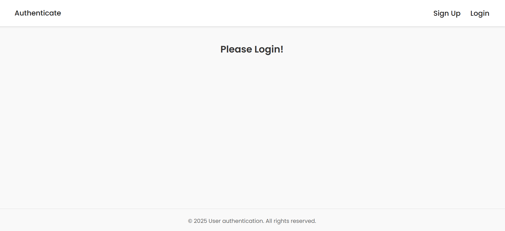
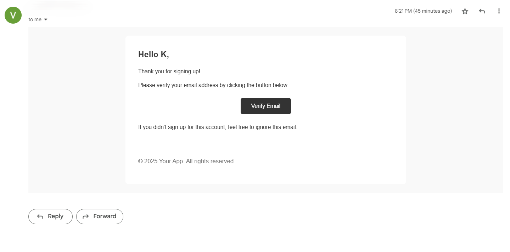
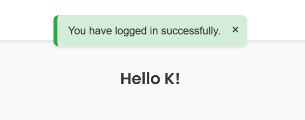

# Django Authentication App 🔐

A complete user authentication system built with **Django 5.2**. Includes user registration, login, logout, email verification, password reset, and secure session management.  

---
## 🖼️ Screenshots

> 
> 
> 

---
## 🚀 Features

-  User Sign Up & Login
-  Secure Password Hashing
-  Email Verification (via Gmail SMTP)
-  Session Authentication
---

## 🛠️ Tech Stack

- **Backend**: Django 5.2
- **Frontend**: Django Templates, HTML/CSS
- **Styling**: Custom CSS + Poppins Font + Js (fade effect)
---

## 📁 Project Structure
```
authenticate/
├── app/ 
│ ├── templates/
│ ├── static/
│ ├── views.py
│ ├── urls.py
│ ├── tokens.py
│ └── ...
│
├── config/
│ ├── settings.py
│ ├── wsgi.py
│ └── ...
│
├── manage.py
├── requirements.txt
└── README.md
```

---

## 🧪 Local Setup

### 1. Clone the Repository

```bash
https://github.com/krishnaverma001/authenticate.git
cd authenticate
```

### 2. Create a Virtual Environment
```bash
python -m venv venv
source venv/bin/activate  # On Windows: venv\Scripts\activate
```

### 3. Install Dependencies
```bash
pip install -r requirements.txt
```

### 4. Set up email settings and debug in settings.py
```bash
EMAIL_HOST = 'your_email_host'
EMAIL_PORT = 587
EMAIL_HOST_USER = 'your_email_address'
EMAIL_HOST_PASSWORD = 'your_email_password' # Use app password from https://myaccount.google.com/apppasswords, do not use your google password.
EMAIL_USE_TLS = True
```

```bash
DEBUG=True
```
### 5. Start the development server

```bash
python manage.py runserver
```

---
## 🧑‍💻 Author
Krishna Verma

GitHub: @krishnaverma001

This project is for learning and demonstration purposes.